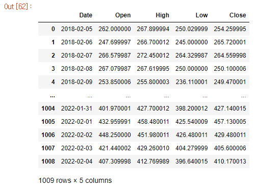
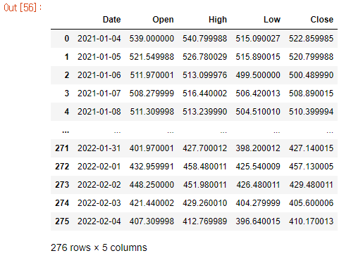
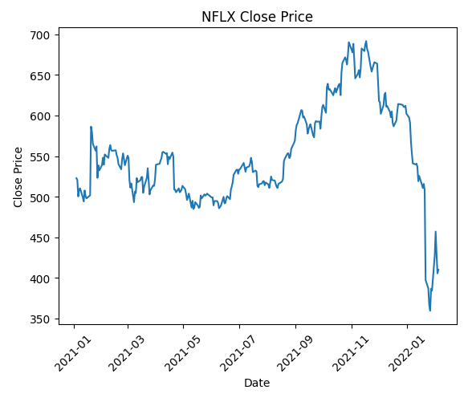
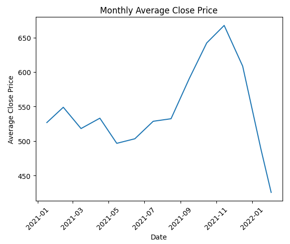
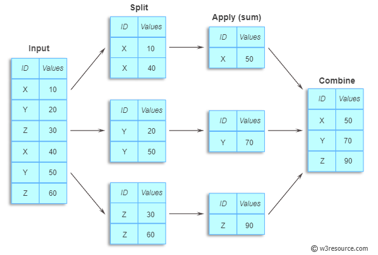
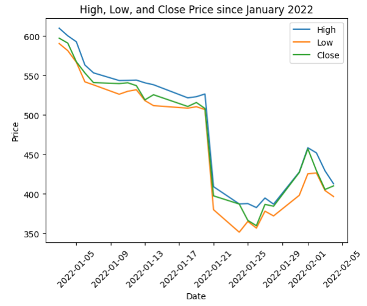
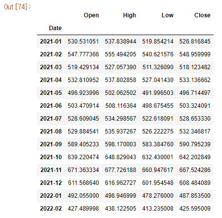
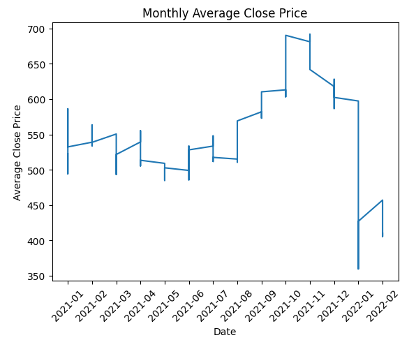

# 넷플릭스 주가 데이터 분석

## A. 데이터 전처리 - 데이터 읽어오기

* Pandas를 사용하여 csv 파일(NLFX.csv)을 DataFrame으로 읽어오기

* 이 때, ['Data', 'Open', 'High', 'Low', 'Close'] 필드만 읽어오도록 구성
  
  <br>

* **코드**
  
  ```python
  csv_path = 'NFLX.csv'
   
  # 경로를 통해 파일 정하고, 해당 파일의 필요한 필드만 가져오기
  df = pd.read_csv(csv_path, usecols=['Date','Open','High','Low','Close'])   사용
  
  df
  ```

    

<br>

* **새롭게 배운 것**
  
  * `pd.read_csv(usecols=['Date'])` 
    
    * pandas에서 csv 파일을 받아올 때, () 안에 usecols=['추출을 원하는 필드명']을 삽입해주면 필요한 필드만 추출하여 받아오는 것이 가능하다.

<br>

<br>

## B. 데이터 전처리 - 2021년 이후의 종가 데이터 출력하기

* csv 파일을 DataFrame으로 읽어와 2021년 이후의 데이터만 필터링
  
  * `to_datetime()`을 활용하여 데이터 타입 변경 후 필터링 진행

* 필터링이 완료된 DataFrame의 종가 데이터를 Matplotlib를 사용하여 시각화

<br>

* **코드** - 데이터 필터링
  
  ```python
  # 필터링이 가능한 형식으로 데이터 타입을 변경
  df["Date"] = pd.to_datetime(df["Date"])
  
  # 2021년 이후의 데이터만 필터링
  df = df[df["Date"]>="2021-01-01"]
  
  # 삭제된 데이터만큼 인덱스 조정
  df = df.reset_index(drop=True)
  
  df
  ```
  
  
  
  <br>

* **코드** - 시각화
  
  ```python
  # 그래프의 X, Y 데이터 삽입
  plt.plot(df['Date'], df['Close'])
  
  # 그래프 제목 작성 
  plt.title('NFLX Close Price')
  
  # 그래프 X축 제목 작성 및 데이터 각도 조정 (가시성)
  plt.xlabel('Date')
  plt.xticks(rotation=45)
  
  # 그래프 Y축 제목 작성
  plt.ylabel('Close Price')
  
  plt.show()
  ```

        

<br>

* **새롭게 배운 것**
  
  - `.reset_index(drop=True)`
    
    - pandas에서는 일부 데이터만 선별하더라도, 인덱스는 선별 전에 가지고 있던 값을 그대로 들고옴을 확인했다.
    
    - 인덱스를 0부터 다시 맞추기 위해 `.reset_index()`함수를 사용했으나, 사용시 index가 조정된 후 기존 index를 보존하는 열이 새롭게 추가되었다.
    
    - 해당 열을 새롭게 추가하지 않고 삭제시키기 위해 drop=True를 사용하였다.

<br>

<br>

## C. 데이터 분석 - 2021년 이후 최고, 최저 종가 출력하기

* 종가(Close) 필드를 활용하여, 2021년 이후 가장 높은 종가와 가장 낮은 종가를 출력합니다.

* Pandas 내장 함수를 사용합니다.

<br>

* **코드**
  
  ```python
  # df의 Close 열에 대한 min, max값 찾기
  max_price = df['Close'].max()
  min_price = df['Close'].min()
  
  print("최고 종가: ", max_price)
  print("최저 종가: ", min_price)
  ```

        

<br>

<br>

## D. 데이터 분석 - 2021년 이후 월 별 평균 종가 출력하기

* 월 별로 그룹화하여 평균 종가를 계산한 새로운 DataFrame을 만들어 그래프로 시각화

<br>

* **코드**
  
  ```python
  # 그룹화를 위해 date를 month까지만 추출하여 변경 후, 월 별로 그룹화
  df_avg = df.groupby(df['Date'].dt.strftime("%Y-%m")).mean()
  
  plt.plot(df_avg['Date'], df_avg['Close'])
  plt.title('Monthly Average Close Price')
  plt.xlabel('Date')
  plt.xticks(rotation=45)
  plt.ylabel('Average Close Price')
  plt.show()
  ```

        

<br>

* **새롭게 배운 것**
  
  * `.groupby()`
    
                            
    
    * 데이터를 그룹별로 분할하여 독립된 그룹에 대해 별도로 데이터를 처리하는 함수
    
    * groupby 3단계
      
      -. Split : 사용자가 정의한 컬럼 조건에 따라 데이터를 독립된 그룹으로 나눔
      
      -. Apply : 나뉘어진 독립된 그룹별 함수를 적용
      
      -. Combine : 각각의 독립된 그룹별로 함수가 적용된 결과를 종합하여 하나의 테이블로 다시 합침
      
      <br>
  
  * `.dt.strftime("%y-%m-%d")`
    
    * 날짜 데이터를 YYYY-MM-DD의 형식으로 변경하는 pandas 날짜 포맷 변경 함수 중 하나
    
    * "%y-%m" 으로 사용하면 YYYY-MM의 형식으로 데이터가 변경되어 월을 기준으로 데이터를 그룹화할 수 있게 된다.

<br>

<br>

## E. 데이터 시각화 - 2022년 이후 최고, 최저, 종가 시각화하기

* Matplotlib를 활용하여 3가지 필드를 한 번에 분석할 수 있도록 시각화
  
  <br>

* **코드**
  
  ```python
  # 새로운 데이터 가공이 필요하므로 파일을 다시 불러오기 
  df_2022 = pd.read_csv(csv_path, usecols=['Date','Open','High','Low','Close'])   
  
  # 필터링이 가능한 형식으로 데이터 타입을 변경
  df_2022["Date"] = pd.to_datetime(df_2022["Date"])
  
  # 2022년 이후의 데이터만 필터링
  df_2022 = df_2022[df_2022["Date"]>="2022-01-01"]
  df_2022 = df_2022.reset_index(drop=True)
  
  
  # X축은 Date, Y축은 High인 그래프를 생성하고, High로 이름 붙이기 
  plt.plot(df_2022['Date'], df_2022['High'], label='High')
  
  # X축은 Date, Y축은 Low인 그래프를 생성하고, Low로 이름 붙이기 
  plt.plot(df_2022['Date'], df_2022['Low'], label='Low')
  
  # X축은 Date, Y축은 Close인 그래프를 생성하고, Close로 이름 붙이기 
  plt.plot(df_2022['Date'], df_2022['Close'], label='Close')
  
  # 그래프 및 축 제목 붙이기 
  plt.title('High, Low, and Close Price since January 2022')
  plt.xlabel('Date')
  plt.xticks(rotation=45)
  plt.ylabel('Price')
  
  # 범례 출력하기 
  plt.legend()
  plt.show()
  ```

        

<br>

<br>

## 구현 과정 중 어려웠던 부분 및 느낀 점

* **어려웠던 부분**
  
  D 문제를 풀 때, 날짜 포맷을 변경한 후 새로운 변수에 저장하지 않고, 
  
  ```python
  df["Date"] = df['Date'].dt.strftime("%Y-%m")
  df.groupby('Date').mean()
  ```
  
  위처럼 기존 DataFrame에 덮어씌우니 DataFrame이 아래와 같이 변경됨. 
  
  
  
  따라서 그래프를 plt 하면 아래처럼 각진 행태로 나타나게 됨.
  
  
  
  이는 위에서 Date 변경 값을 기존 값에 덮어 씌우는 과정에서, Date값이 인덱스화 됨에 따라 더 이상 DataFrame의 data로 작용하지 못하게 되었기 때문임.
  
  따라서 Date 포맷 변경 값을 새로운 변수에 저장 후, 해당 값을 기준으로 groupby와 plt을 실행하니 정상적인 결과가 나타남.

<br>

* **느낀 점**
  
  : 개인적인 편의성을 위해 값 변경이 발생하는 과정에도 새로운 변수를 생성하지 않고 기존 값에 덮어씌우다보니, 오히려 오류 발생의 원인이 됨을 알게 되었음.
  
  : 앞으로는 가독성과 코드 구조, 독립성을 위해 변수를 각각 잘 설정해야겠다고 다짐함. 


