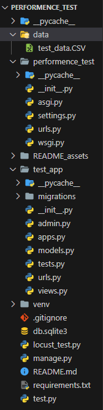
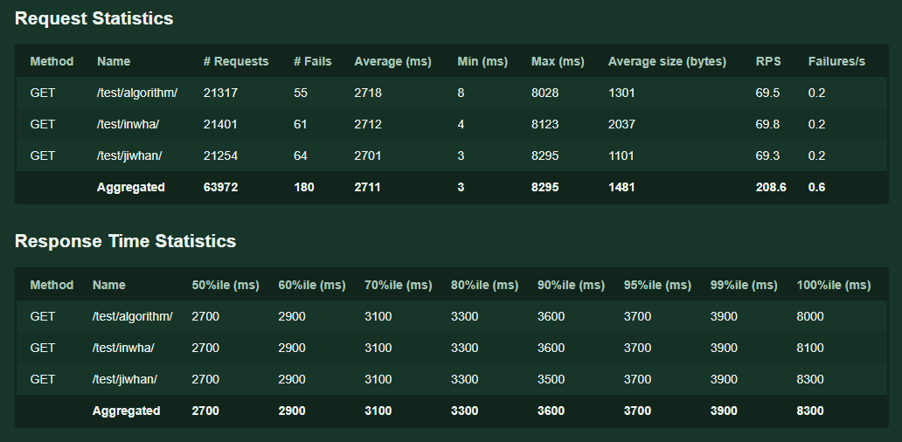
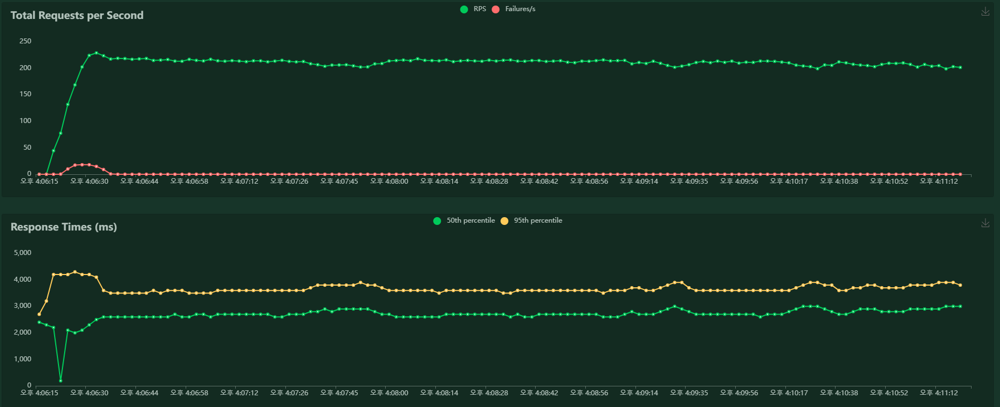

# [PJT 08] Django에서 알고리즘 구현 및 성능 측정

<br>

* 파일 구조
  
  
  
  <br>

* test_app의 urls.py
  
  ```python
  from django.urls import path
  from . import views
  
  urlpatterns = [
      path('normal_sort/', views.normal_sort),
      path('priority_queue/', views.priority_queue),
      path('bubble_sort/', views.bubble_sort),
      path('csv_to_DF/', views.csv_to_DF),
      path('missing_value/', views.missing_value),
      path('algorithm/', views.algorithm),
      path('jiwhan/', views.jiwhan),
      path('inwha/', views.inwha),
  ]
  ```

<br>

## A. CSV 데이터를 DataFrame으로 변환 후 반환

* views.py - **csv_to_DF** 함수
  
  ```python
  csv_path = 'data/test_data.csv'
  
  def csv_to_DF(request):
      # csv파일 로딩
      df = pd.read_csv(csv_path, encoding='cp949', usecols=['이름', '나이'])
      data = df.to_dict('records')
  
      return JsonResponse({ 'data': data })
  ```

<br>

<br>

## B. 결측기 처리 후 데이터 반환

* views.py - **missing_value** 함수
  
  ```python
  csv_path = 'data/test_data.csv'
  
  def missing_value(request):
      df = pd.read_csv(csv_path, encoding='cp949', usecols=['이름', '나이'])
      # dataframe의 '나이'열이 빈 값인 곳은 문자열 'null'로 채워준다.
      df['나이'].fillna('null', inplace=True)
      data = df.to_dict('records')
  
      return JsonResponse({ 'data': data })
  ```
  
  <br>
  
  * `.fillna()`
    
    : 결측값을 다른 적절한 값으로 채워준다.

<br>

<br>

## C. 알고리즘 구현하기

* views.py - **algorithm** 함수
  
  ```python
  def algorithm(request):
      df = pd.read_csv(csv_path, encoding='cp949', usecols=['이름', '나이'])
  
      # dataframe의 '나이' 열의 값에 대한 평균값을 계산하여 avg_older 변수에 할당
      avg_older = df['나이'].mean()
  
      # dataframe에 '평균 나이와의 차' 열 추가 및 해당 열의 값 0으로 초기화
      df['평균 나이와의 차'] = 0
  
      # dataframe의 각 행에 대해 index와 row 전체를 받아오며 순회
      for idx, row in df.iterrows():
          # 탐색중인 행의 '나이' 열의 값을 this_older 변수에 할당
          this_older = row['나이']
          # '평균 나이와의 차' 열의 idx 행의 값으로 avg_older와 this_order의 절댓값을 할당
          df['평균 나이와의 차'][idx] = abs(avg_older - this_older)
  
      # '평균 나이와의 차' 열을 기준으로 dataframe을 오름차순 정렬한 뒤, 0~9번째 행까지만 받기
      sort_df = df.sort_values(by=['평균 나이와의 차']).iloc[:10]
  
      data = sort_df.to_dict('records')
  
      return JsonResponse({ 'data': data })
  ```
  
  <br>
  
  * `.iterrows()`
    
    : 행의 인덱스 이름(=`idx`)과 행 정보(=`row`)를 담고 있는 Series 객체를 반환 
    
    * 참고 : [[Pandas] 24. 데이터프레임(Dataframe) 순회(loop)하기 - 행 방향 순회, 열 방향 순회](https://zephyrus1111.tistory.com/172)
      
      <br>
  
  * `.sort_values`
    
    : 기준 열에 대해 data를 오름차순 정렬
    
    <br>
  
  * `.iloc()`
    
    : 숫자를 이용한 범위 또는 데이터 선택    (like slicing @Python)
    
    * [파이썬[Python] Pandas, DataFrame의 범위를 이용한 열, 행 선택 방법(iloc)](https://appia.tistory.com/199)

<br>

<br>

## D. Locust를 활용한 알고리즘 성능 측정

### 비교 결과





* 총 사용자 : 1000, 동시 사용자 : 100

* 초기에 평목 현상이 발생했으나, 시간이 지날수록 안정화됨

* 평균 RPS : 69.5

* 응답 시간 : 모든 응답 8초 이내

* 다른 사람들의 알고리즘 응답시간과 비교해 보았을 때, 전체적으로 성능의 차이는 거의 발생하지 않았다. 

* 다만, 실제 웹에서 필요한 응답이라고 생각하면 꽤 오랜 시간이 걸리는 것으로 판단된다. 알고리즘 내에서 모든 Dataframe의 모든 행을 순회해야 하고, 솔팅하는 과정에서 시간이 소요된 것이 아닐까 예상해본다. 


